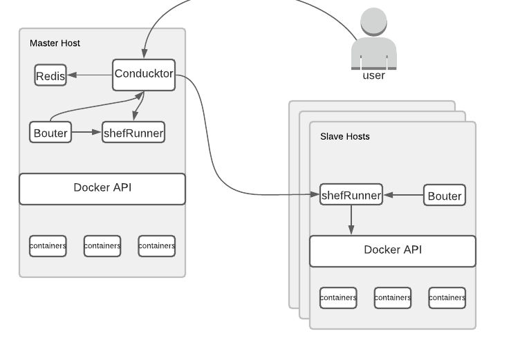

# Docker-shef (shef)

Docker-shef is a POC system for managing docker containers across multiple hosts via REST API. It provides basic mechanisms for docker service deployment and scaling. Because this is a POC system you can only decide docker service name, docker image and replica count. Container networking, volume and port bindings aren't covered by this POC system.

Docker-shef build with nodejs v14 and uses docker API on hosts to manage containers. System can tolerate lost of any slave docker host and in case of failure containers will be migrated to health slaves.

This system has inspired from Kubernetes architecture and works with Master-Slave design to manage docker hosts. Docker-shef consist of 4 components Bouter, Conducktor, shefRunner and Redis.



### [Bouter](https://github.com/docker-shef/bouter)

Bouter is booter of the system(I like word games). Bouter designed for easier deployment of docker-shef master and slaves. Bouter manages lifecycle of all other system components. It boots them with necessary variables, volume and port bindings.

### [Conducktor](https://github.com/docker-shef/conducktor)

Conducktor is API server and conduc(🦆)tor of the system. It handles requests from users and checks availabilities of shefRunners. Conducktor decides where to create containers and balances them between nodes properly. Conducktor triggers shefRunners via http calls to create or delete containers on docker hosts. Default 8044 port used for REST API endpoints. You can find specific endpoint documentation [here](#api-endpoints).

### [ShefRunner](https://github.com/docker-shef/shefRunner)

ShefRunner is docker host agent of the system. It is responsible for creating and deleting containers ordered by Conducktor.

### Redis

Redis used as metadata KeyValue database of system. Detailed information of runners, services and containers stored in Redis with stats of system.


## Installation

Docker-shef supports amd64 and arm64 architectures. Tested on Docker Engine >v19, supports Docker Desktop Mac/Windows.

### Requirements
- Docker Engine >v19
- Root privileged user to start Bouter service.

### Easy Installation

To start Docker-shef master node, fill the \<MASTER HOST IPv4\> with IP of docker host. This will star bouter, conducktor, shefRunner and redis containers with proper configurations.
```
docker run -d --restart unless-stopped --name bouter -e HOST_IP=<MASTER HOST IPv4> \
  -v /var/run/docker.sock:/var/run/docker.sock \
  -l shef-bouter=true seljuke/bouter:latest
```

To add slave nodes to master set `SLAVE` environment variable to true and fill \<SLAVE HOST IPv4\> with docker host IP and \<MASTER HOST IPv4\> with master host IP. This will start bouter and shefRunner containers with proper configurations.
```
docker run -d --restart unless-stopped --name bouter -e HOST_IP=<SLAVE HOST IPv4> \
  -e SLAVE=true \
  -e MASTER_HOST=<MASTER HOST IPv4> \
  -v /var/run/docker.sock:/var/run/docker.sock \
  -l shef-bouter=true seljuke/bouter:latest
```

After containers up and running you can start interact with Conducktor REST API through `http://<MASTER HOST IPv4>:8044`.


## **API Endpoints**

There is total of 3 Endpoints and 6 options.

## **/service**

`/service` endpoint manages the docker service deployments. You can create, delete or update services using this endpoint. It will only accept `Content-Type: application/json` and respond with json as well.

To **create** service use `POST` method with data body like below:

```json
{
    "serviceName": "<service name[string]>",
    "image": "<docker image name[string]>",
    "replicas": <replica count[integer]>
}
```

To **get** service state use `GET` method with data body like below:

```json
{
    "serviceName": "<service name[string]>"
}
```

To **delete** service use `DELETE` method with data body like below:

```json
{
    "serviceName": "<service name[string]>"
}
```

To **update** replica count of service use `PUT` method with data body like below:

```json
{
    "serviceName": "<service name[string]>",
    "replicas": <replica count[integer]>
}
```

## **/state**

You can use the `/state` endpoint to view cluster state and get information like status of runners, services, containers.

To view cluster state just send a `GET` request to `/state` endpoint.

## **/stats**

You can use `/stats` endpoint to get cluster statistics like succeeded and failed request, created and deleted containers and services

To view cluster statistics just send a `GET` request to `/stats` endpoint.

## Final Notes

Because this system is just a POC there are a lot of improvement points. I will not touch additional features but just must haves in container orchestrators.

### Security

There is no implementation for any kind of authorization and authentication in project. In reality there has to be authorization and authentication solution between Conducktor API and users with secure channels. As an addition system components inter-cluster communications should managed via secure channels.

### High Availability

Docker-shef system has a master-slave design in its core, but there is no High-Availability implementation for masters. Redis can be manually deployed in HA mode and system components can configured via Environment variables.

### Networking

This POC system doesn't cover any container networking, but it can be implemented easily with some third party CNI(container network interfaces) like calico or weaveNet. 

For external cluster communication Kubernetes ingress like network management is best practice for my opinion.

### Command Line Interface

There is no cli for docker-shef, but it would be the best way to manage services using docker-shef.
